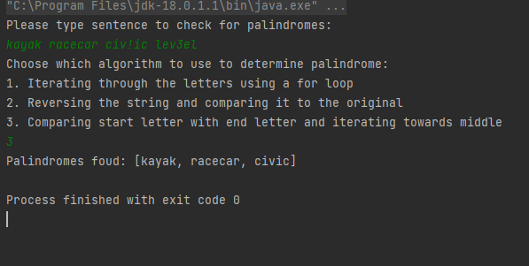

# Palindrome checker

## About the project
This program allows you to check if a sentence contains palindromes and lets you choose between 3 different algorithms.
The purpose of this project is to demonstrate the use of interfaces.

## Built with
This program uses core JAVA.

## Getting started
This program requires the Java SDK installed.
Simply clone the repo and run it.
Input a sentence and select one of the 3 algorithms and you will receive the result in the terminal.

Example:


## Palindrome interface implementations

1. Iterating through the letters using a for loop
```JAVA
public class PalFirst implements PalInterface {
    public boolean isPalindrome(String s) {
        // add null check and empty string input
        String noSpaces = s.toLowerCase();
        int length = noSpaces.length();

        for (int i = 0; i < length / 2; i++) {
            if (noSpaces.charAt(i) != noSpaces.charAt(length - i - 1)) {
                return false;
            }
        }
        return true;
    }
}
```

2. Reversing the string and comparing it to the original
```JAVA
public class PalSecond implements PalInterface{
    @Override
    public boolean isPalindrome(String s) {
        String noSpaces = s.toLowerCase();
        StringBuilder reverseNoSpaces = new StringBuilder(noSpaces);

        return reverseNoSpaces.reverse().toString().equals(noSpaces);
    }
}

```

3. Comparing start letter with end letter and iterating towards middle
```JAVA
public class PalThird implements PalInterface {

    @Override
    public boolean isPalindrome(String s) {
        String noSpaces = s.toLowerCase();
        int stringStart = 0;
        int stringEnd = noSpaces.length() - 1;

        while (stringStart < stringEnd) {
            if (noSpaces.charAt(stringStart) != noSpaces.charAt(stringEnd)) {
                return false;
            }
            stringStart += 1;
            stringEnd -= 1;
        }
        return true;
    }
}
```
## Author
Andrei Hirleata